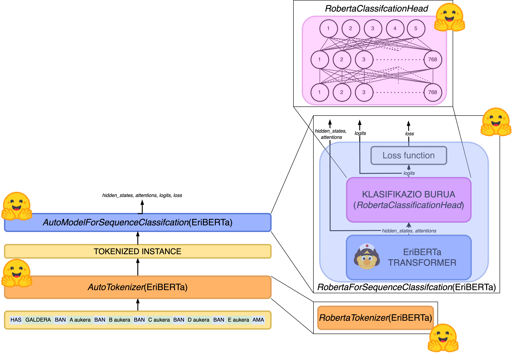
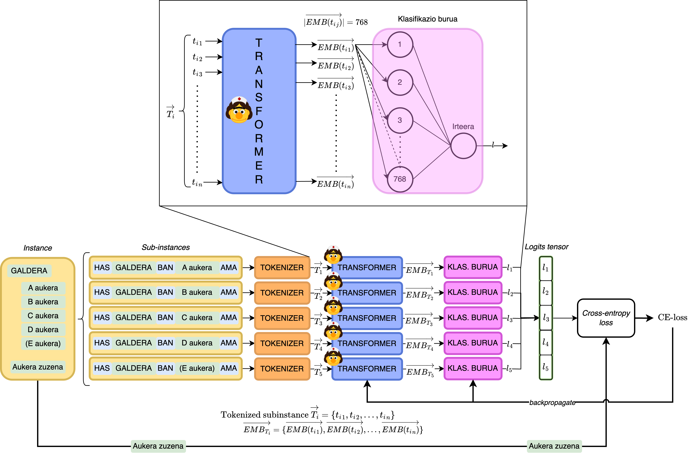

# Medikuntzako galderak erantzuteko sistema elebiduna: hizkuntza-ereduen arkitektura desberdinen ekarpenak

  

Lan honek Adimen Artifizialeko hizkuntza-eredu elebidun bat garatzea eta entrenatzea du helburu, Barne Mediku Egoiliarra (BAME) medikuntza azterketa galderen erantzun posible kopuru aldakor bat ebazteko gai izango dena, Hizkuntza Naturalaren Prozesamenduaren eta Ikasketa Sakonaren artearen egoerako teknikak erabiliz.

Ataza honen inguruan aurretik egindako ikerketetan oinarrituta, lan honen esperimentazioak ezagutza-oinarri sendoa du ereduak entrenatzeko. Aurreko ikerketetan ez bezala, lan honetan sortutako ereduek BAME azterketen adibideen bidez soilik jasotzen dute informazioa, kanpoko informazio-iturrietan kontsultatu gabe.

Lan honetan garatutako hizkuntza-ereduak gai dira BAME azterketetako galderen berezitasunak ikasteko. Horretarako, azterketetako galderen erantzun kopuru aldakor bati erantzuteko gai diren eredu-arkitektura desberdinak proposatzen dira aurretiazko ikerketen arkitekturak moldatuz.

Gaztelaniazko eta ingelesezko azterketa-multzoak erabiliz, proiektu honetan sortutako ereduek azterketa horiei erantzuteko gaitasun elebiduna dute orain arte garatutako eredu gehienetan ez bezala, ingelesa bakarrik erabiltzen dutenak.

## Arkitekturak

Hizkuntza-ereduen bi arkitekturen esperimentatu da, *baseline* eta MedMCQA arkitektura.

*Baseline* arkitektura:

MedMCQA arkitektura:

## Datu-sortak

Erabili diren bi datu-sortak hurrengoak dira:

- MedMCQA datu-sorta:
    - [github.com/medmcqa/medmcqa](https://github.com/medmcqa/medmcqa)-tik hartuta. Ere eskuragarri: [huggingface/medmcqa](https://huggingface.co/datasets/medmcqa)
- CasiMedicos datu-sorta: [github.com/ixa-ehu/antidote-casimedicos](https://github.com/ixa-ehu/antidote-casimedicos)-tik hartuta

## Aurre-entrenatutako eredua

Erabili den aurre-entrenatutako modeloa [EriBERTa: A Bilingual Pre-Trained Language Model for Clinical Natural Language Processing
](https://arxiv.org/abs/2306.07373) da. [HiTZ/EriBERTa-base](https://huggingface.co/HiTZ/EriBERTa-base)-en eskuragarri.

## Proiekturaren egitura

Esperimentuak [src](src) direktorioan zerrendatuta daude. Honetako bakoitzak bere direktorioa du bere readme-arekin batera.

## Beste dependentziak

      