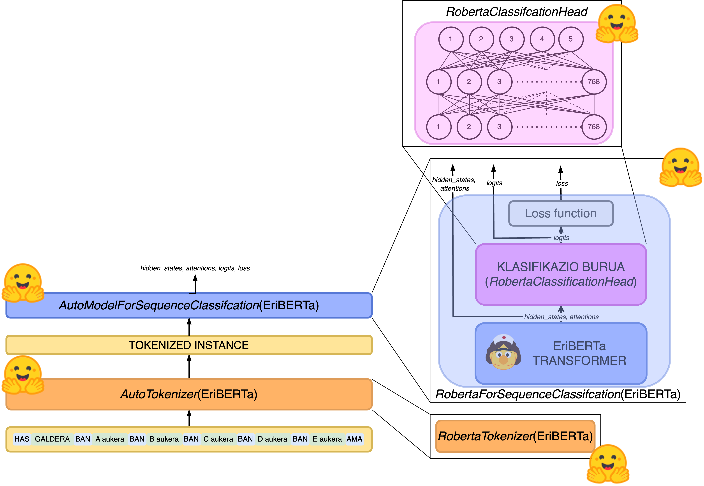
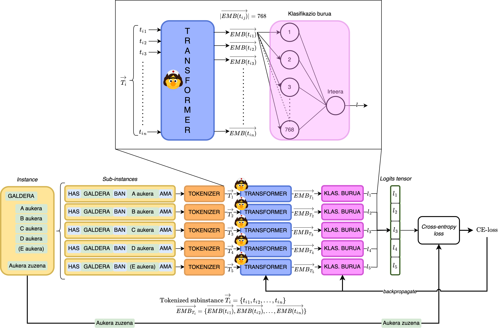

# Bilingual system for solving medical questions: contribution with different architectures of language models

  

The present work focuses on the implementation and training of a bilingual Artificial Intelligence language model capable of solving questions of the medical *Médico Interno Residente* (MIR) exams with a variable number of possible answers, using state-of-the-art techniques from Natural Language Processing and Deep Learning.

Based on previous research in this task, the experimentation of this work has a solid knowledge base for training the models. In contrast to previous research, the models developed in this work receive information solely through examples of MIR exams without consulting any external information sources.

The language models developed in this work are able to learn the singularities of the MIR exam questions. To this end, different model architectures capable of answering exam questions with a variable number of possible options are proposed by modifying architectures from previous research. 

By making use of exam sets in Spanish and English, the developed models in this project demonstrate a bilingual capability to answer these exams. This contrasts with most of the models developed to date in this type of task, which use only English.

## Architectures

2 language model architectures had been experimented, *baseline* and MedMCQA architecture.

*Baseline* architecture:

MedMCQA architecture:

## Dataset

The two datasets used are:

- MedMCQA dataset:
    - Taken from [github.com/medmcqa/medmcqa](https://github.com/medmcqa/medmcqa). Also available: [huggingface/medmcqa](https://huggingface.co/datasets/medmcqa)
- CasiMedicos dataset: taken from [github.com/ixa-ehu/antidote-casimedicos](https://github.com/ixa-ehu/antidote-casimedicos)

## Pre-trained model

The pre-trained model to use is [EriBERTa: A Bilingual Pre-Trained Language Model for Clinical Natural Language Processing
](https://arxiv.org/abs/2306.07373). Available in [HiTZ/EriBERTa-base](https://huggingface.co/HiTZ/EriBERTa-base).

## Project structure

The experiments are listed into the [src](src) directory. Each one has its directory with its readme file.

## Other dependencies

      